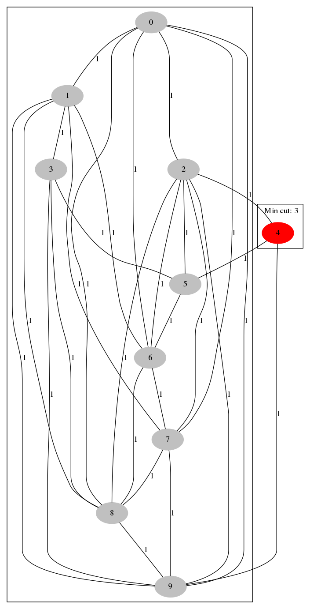

# Minimum cut of an undirected graph
The Stoer-Wagner min cut algorithm determines a min-cut and the min-cut weight of a connected, undirected graph.

A cut of a graph G is a partition of the vertices into two, non-empty sets. The weight of such a partition is the number of edges between the two sets if G is unweighted, or the sum of the weights of all edges between the two sets if G is weighted. A min-cut is a cut having the least weight. 

In this work you can find demonstrative realization of min-cut algorithm. It generates png image of graph using graphviz tool. \
So, you're gonna need to use following commands after cloning the repo:
```Terminal
cd ./terminal-edition
./lab02 | dot -Tpng -o $RANDOM.png
```
> Output is visualizesd through [**Graphviz**](https://www.graphviz.org/) tool.\
> Graphviz is a standard package on many linux distributions. You can check if it is installed with a command like 
```Terminal 
dpkg -s graphivz
```
> If it is not installed, you should be able to install it with your system's package manager. i.e. 
```Terminal 
sudo apt-get install graphviz
```
> or search 'graphivz' in the Software Center on Ubuntu.

After that just list all files of the directory
```Terminal
ls
```
You are supposed to see **.png** files, they contain picture of random graph with number of nodes that were cut by a program.\
To remove test images (**.png** files), type
```Terminal
rm *.png
```
You also can view the source code in **./src** folder.\
### Demo:
Result of the program work should look similar to that image.
 
*That's about all* :octocat: :two_hearts:

